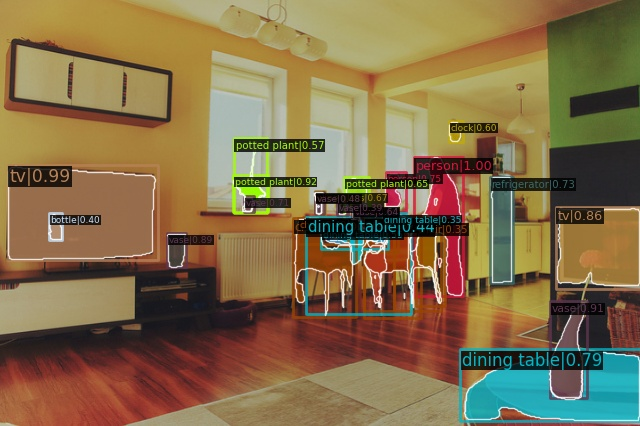
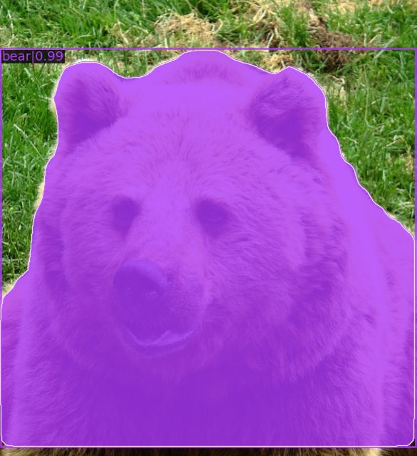
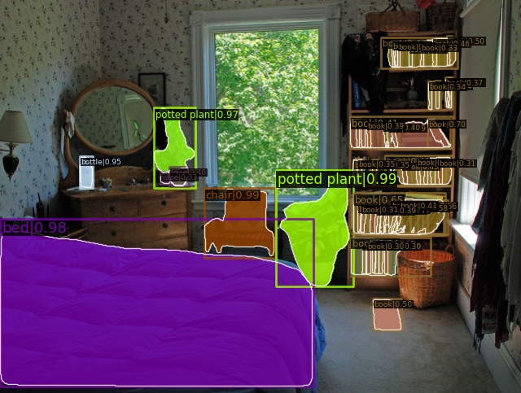
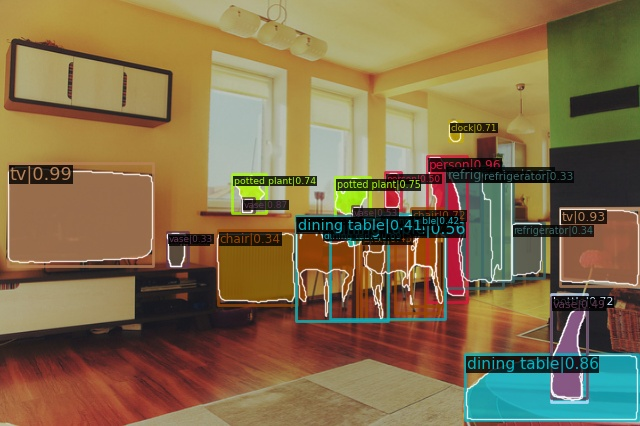
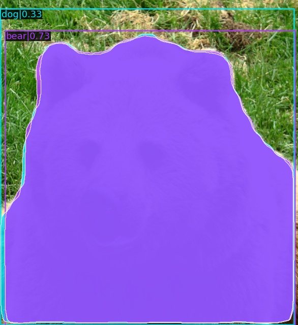
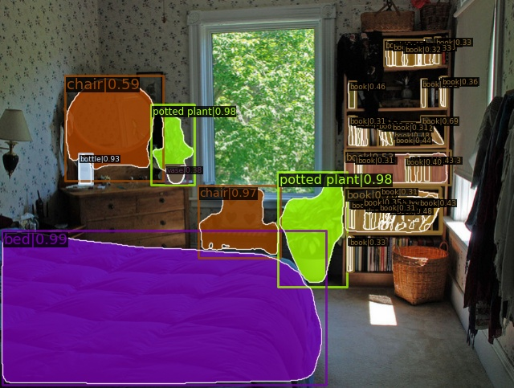

# DLS_FINAL_mmdetection

Supervised Training in the New York University 2021 Intro To Deep Learning System Class final project, use mmdetection package

## Yuanzhe Liu yl9539@nyu.edu

## Chieh-Hsin Chen cc7204@nyu.edu

# ## Links

For Self Supervised Learning MoBY to train Swin Transformer, also the main part of the whole project, please consult:

https://github.com/ggflow123/DLS_Final_Project

For Self Supervised Learning DINO to train ResNet-50, please consult:

https://github.com/ggflow123/DLS_FINAL_DINO

# Usage

## Environment Setup

For the environment setup, please do directly to the official mmdetection github:
https://github.com/open-mmlab/mmdetection

I first consulted this page:
https://github.com/SwinTransformer/Swin-Transformer-Object-Detection

Then, the version of mmcv-full and pytorch are not compatible. Please follow the official installation of mmdetection. The link is available below:
https://mmdetection.readthedocs.io/en/stable/get_started.html

## Data Peparation

We use 2017 COCO Dataset. Mmdetection gives a nice download.
You can use coco2017, voc2007 or LVIS.
In the folder, do:

```
python tools/misc/download_dataset.py --dataset-name coco2017
python tools/misc/download_dataset.py --dataset-name voc2007
python tools/misc/download_dataset.py --dataset-name lvis
```

For more info, please consult https://github.com/open-mmlab/mmdetection/blob/master/docs/en/useful_tools.md#dataset-download

## Running

All the configuration files are in the **config** folder. For more info, please check https://github.com/open-mmlab/mmdetection/blob/master/docs/en/tutorials/config.md.

To submit a job in NYU Greene or Linux Cloud Computing environment, scripts are available in the **scripts** folder.

For example, to train a Mask R-CNN + FPN with Swin Transformer as the backbone, with 4 GPU and 24 hours, in the scripts folder, do:

```
sbatch train_load.slurm
```

To run directly, do:

```
bash ./tools/dist_train.sh ./configs/swin/mask_rcnn_swin-t-p4-w7_fpn_1x_coco_datapath_loadckpt.py 4

```

where ``mask_rcnn_swin-t-p4-w7_fpn_1x_coco_datapath_loadckpt.py`` is the configuration file. You can customize the configuration file by yourself. For me, don't run with this configuration file directly. I changed the path of the data. Please be careful.

# Results

The results below are all based on the models with1 epoch training on COCO 2017 training dataset.

The results are the COCO 2017 test dataset.

### For Swin Backbone:

#### Bounding Box - 10 epochs training

Average Precision  (AP) @[ IoU=0.50:0.95 | area=   all | maxDets=100 ] = 0.421

 Average Precision  (AP) @[ IoU=0.50      | area=   all | maxDets=1000 ] = 0.644

 Average Precision  (AP) @[ IoU=0.75      | area=   all | maxDets=1000 ] = 0.461

 Average Precision  (AP) @[ IoU=0.50:0.95 | area= small | maxDets=1000 ] = 0.261

 Average Precision  (AP) @[ IoU=0.50:0.95 | area=medium | maxDets=1000 ] = 0.453

 Average Precision  (AP) @[ IoU=0.50:0.95 | area= large | maxDets=1000 ] = 0.557

 Average Recall     (AR) @[ IoU=0.50:0.95 | area=   all | maxDets=100 ] = 0.558

 Average Recall     (AR) @[ IoU=0.50:0.95 | area=   all | maxDets=300 ] = 0.558

 Average Recall     (AR) @[ IoU=0.50:0.95 | area=   all | maxDets=1000 ] = 0.558

 Average Recall     (AR) @[ IoU=0.50:0.95 | area= small | maxDets=1000 ] = 0.376

 Average Recall     (AR) @[ IoU=0.50:0.95 | area=medium | maxDets=1000 ] = 0.592

 Average Recall     (AR) @[ IoU=0.50:0.95 | area= large | maxDets=1000 ] = 0.708

#### Segmentation

 Average Precision  (AP) @[ IoU=0.50:0.95 | area=   all | maxDets=100 ] = 0.390

 Average Precision  (AP) @[ IoU=0.50      | area=   all | maxDets=1000 ] = 0.615

 Average Precision  (AP) @[ IoU=0.75      | area=   all | maxDets=1000 ] = 0.420

 Average Precision  (AP) @[ IoU=0.50:0.95 | area= small | maxDets=1000 ] = 0.198

 Average Precision  (AP) @[ IoU=0.50:0.95 | area=medium | maxDets=1000 ] = 0.417

 Average Precision  (AP) @[ IoU=0.50:0.95 | area= large | maxDets=1000 ] = 0.570

 Average Recall     (AR) @[ IoU=0.50:0.95 | area=   all | maxDets=100 ] = 0.521

 Average Recall     (AR) @[ IoU=0.50:0.95 | area=   all | maxDets=300 ] = 0.521

 Average Recall     (AR) @[ IoU=0.50:0.95 | area=   all | maxDets=1000 ] = 0.521

 Average Recall     (AR) @[ IoU=0.50:0.95 | area= small | maxDets=1000 ] = 0.338

 Average Recall     (AR) @[ IoU=0.50:0.95 | area=medium | maxDets=1000 ] = 0.556

 Average Recall     (AR) @[ IoU=0.50:0.95 | area= large | maxDets=1000 ] = 0.680







### For ResNet-50 Backbone - 10 epochs training:

#### Bounding Box

Average Precision  (AP) @[ IoU=0.50:0.95 | area=   all | maxDets=100 ] = 0.362

 Average Precision  (AP) @[ IoU=0.50      | area=   all | maxDets=1000 ] = 0.562

 Average Precision  (AP) @[ IoU=0.75      | area=   all | maxDets=1000 ] = 0.395

 Average Precision  (AP) @[ IoU=0.50:0.95 | area= small | maxDets=1000 ] = 0.204

 Average Precision  (AP) @[ IoU=0.50:0.95 | area=medium | maxDets=1000 ] = 0.395

 Average Precision  (AP) @[ IoU=0.50:0.95 | area= large | maxDets=1000 ] = 0.468

 Average Recall     (AR) @[ IoU=0.50:0.95 | area=   all | maxDets=100 ] = 0.516

 Average Recall     (AR) @[ IoU=0.50:0.95 | area=   all | maxDets=300 ] = 0.516

 Average Recall     (AR) @[ IoU=0.50:0.95 | area=   all | maxDets=1000 ] = 0.516

 Average Recall     (AR) @[ IoU=0.50:0.95 | area= small | maxDets=1000 ] = 0.325

 Average Recall     (AR) @[ IoU=0.50:0.95 | area=medium | maxDets=1000 ] = 0.555

 Average Recall     (AR) @[ IoU=0.50:0.95 | area= large | maxDets=1000 ] = 0.647


### Segmentation


 Average Precision  (AP) @[ IoU=0.50:0.95 | area=   all | maxDets=100 ] = 0.331

 Average Precision  (AP) @[ IoU=0.50      | area=   all | maxDets=1000 ] = 0.533

 Average Precision  (AP) @[ IoU=0.75      | area=   all | maxDets=1000 ] = 0.350

 Average Precision  (AP) @[ IoU=0.50:0.95 | area= small | maxDets=1000 ] = 0.149

 Average Precision  (AP) @[ IoU=0.50:0.95 | area=medium | maxDets=1000 ] = 0.355

 Average Precision  (AP) @[ IoU=0.50:0.95 | area= large | maxDets=1000 ] = 0.481

 Average Recall     (AR) @[ IoU=0.50:0.95 | area=   all | maxDets=100 ] = 0.470

 Average Recall     (AR) @[ IoU=0.50:0.95 | area=   all | maxDets=300 ] = 0.470

 Average Recall     (AR) @[ IoU=0.50:0.95 | area=   all | maxDets=1000 ] = 0.470

 Average Recall     (AR) @[ IoU=0.50:0.95 | area= small | maxDets=1000 ] = 0.279

 Average Recall     (AR) @[ IoU=0.50:0.95 | area=medium | maxDets=1000 ] = 0.510

 Average Recall     (AR) @[ IoU=0.50:0.95 | area= large | maxDets=1000 ] = 0.610







# Model Files

| Mask R-CNN + FPN + Swin Transformer                                                                                                                                                      | Mask R-CNN + FPN + ResNet-50                                                                                                                                                            |
| ---------------------------------------------------------------------------------------------------------------------------------------------------------------------------------------- | --------------------------------------------------------------------------------------------------------------------------------------------------------------------------------------- |
| [Epoch-1](https://drive.google.com/file/d/1ICCtjaznnKimzO2ec3w3kjs-OW-jUcm5/view?usp=sharing)  [Epoch-10](https://drive.google.com/file/d/1OdKw0wKUis8rrCYk3-rxyYSd9BlyAbPU/view?usp=sharing) | [Epoch-1](https://drive.google.com/file/d/1jH8BrW0dZfGt0h3aIp-9oo_zgCHw4jPG/view?usp=sharing) [Epoch-10](https://drive.google.com/file/d/1T4-Aaq8pjXbFXA02DIyY01EkVLSsFW1m/view?usp=sharing) |
